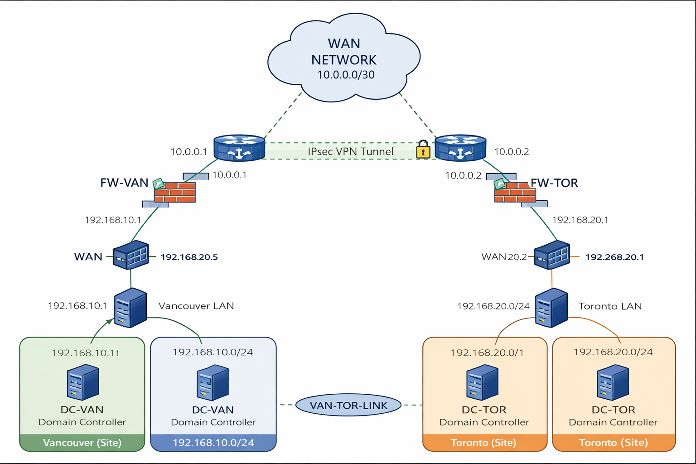

# Multi-Site Active Directory Replication over IPsec VPN

Hyper-V lab demonstrating **multi-site Active Directory replication** between **Vancouver** and **Toronto** using a **RRAS IPsec Site-to-Site VPN tunnel**.

This project simulates a company with two physical offices where both locations must replicate Active Directory objects securely across a WAN connection.

---

# Lab Architecture

This lab simulates two geographically separated offices connected through a secure IPsec VPN tunnel.

Each location contains:

• Firewall / Router (RRAS)  
• Internal LAN  
• Domain Controller  
• Active Directory Site  

Active Directory replication occurs securely across the VPN tunnel.

---

# Network Diagram



---

# Environment

| Component | Technology |
|----------|------------|
| Hypervisor | Hyper-V |
| VPN | RRAS IPsec Site-to-Site |
| Directory Services | Active Directory Domain Services |
| DNS | Windows DNS |
| Replication | Multi-Site AD Replication |

---

# Network Design

### WAN Network

---

10.0.0.0/30
---

### Vancouver LAN
```
192.168.10.0/24
```

### Toronto LAN
```
192.168.20.0/24
```
# Servers
| Server | Role | Location |
|-------|------|---------|
| FW-VAN | RRAS firewall/router | Vancouver |
| FW-TOR | RRAS firewall/router | Toronto |
| DC-VAN | Domain Controller | Vancouver |
| DC-TOR | Domain Controller | Toronto |

# Project Steps
# Replication Testing
# Tools Used
# Key Concepts Demonstrated
# Author
